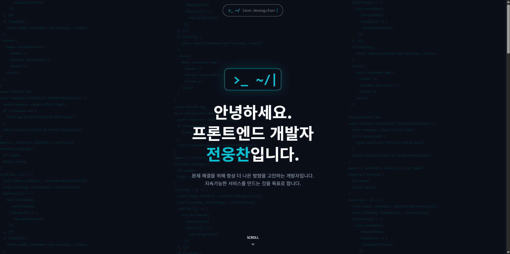
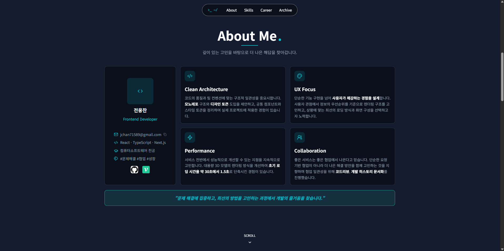
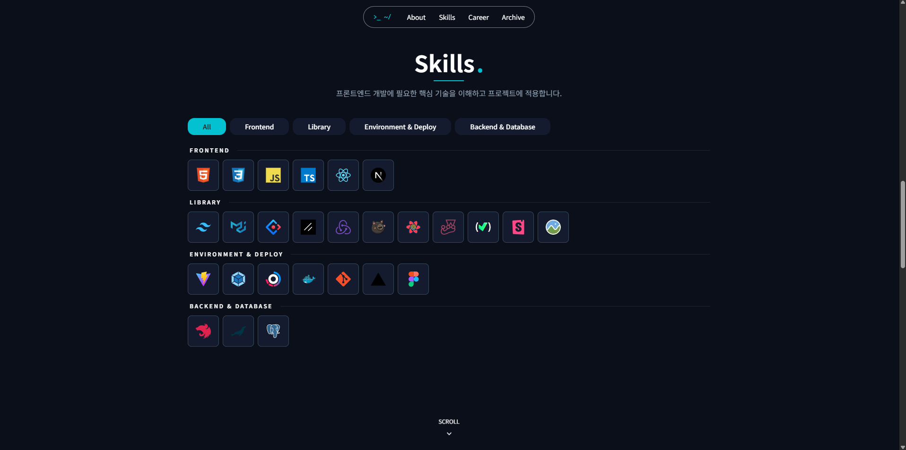
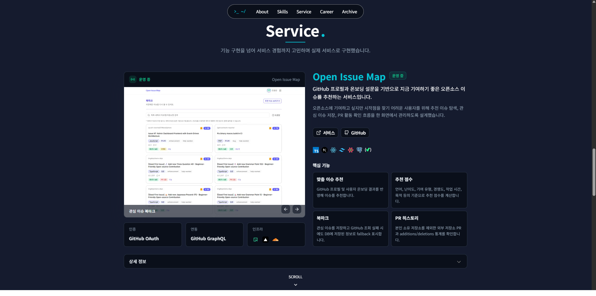
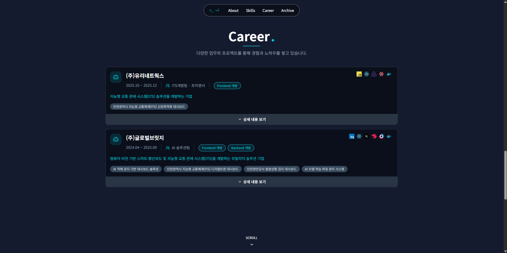
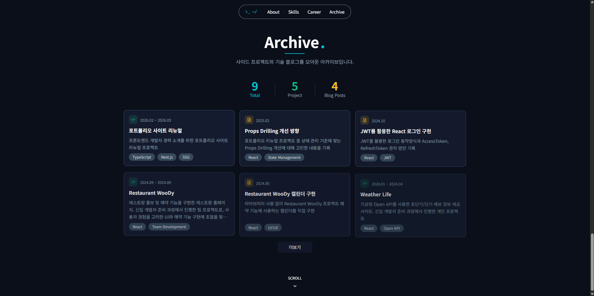
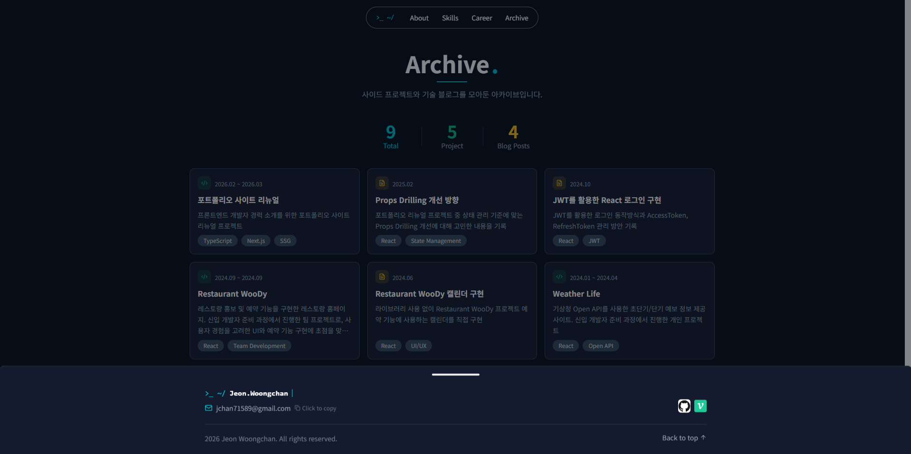

# Portfolio 2026

프론트엔드 개발자 포트폴리오 웹사이트입니다.  
섹션 중심의 싱글 페이지 구조로 설계했으며, 렌더링 전략과 서버/클라이언트 컴포넌트 적용 방식을 적용해보기 위해 Next.js를 사용했습니다.

- 배포 URL: https://woongchan.vercel.app/

## 기술 스택

- Framework: Next.js, React
- Language: TypeScript
- Styling: Tailwind CSS
- UI/Utility: Radix UI(shadcn/ui)

## 섹션 구성과 구현 방식

### 1) Hero


- 목적: 첫 인상 전달, 개발자 브랜딩, 인트로 애니메이션
- 관련 코드:
  - `src/components/hero/*`
  - `src/hooks/hero/useHeroIntroSequence.ts`

### 2) About


- 목적: 개발 성향, 협업 방식, 핵심 강점 소개
- 관련 코드:
  - `src/components/about/*`
  - `data/about.ts`

### 3) Skills


- 목적: 카테고리별 기술 스택(Frontend/Library/DevOps/Backend) 전달
- 관련 코드:
  - `src/components/skills/*`
  - `data/skills.ts`

### 4) Service


- 목적: 서비스 관점의 프론트엔드 역량을 보여주기 위해 실제 운영 중인 서비스를 소개
- 관련 코드:
  - `src/components/live-service/*`
  - `data/liveService.ts`
  - `src/types/liveService.ts`
  - `components/ui/carousel.tsx`

### 5) Career


- 목적: 회사/프로젝트 단위 경력과 성과 하이라이트 전달
- 관련 코드:
  - `src/components/career/*`
  - `data/career.ts`

### 6) Archive


- 목적: 프로젝트/블로그 이력 아카이브
- 관련 코드:
  - `src/components/archive/*`
  - `data/archive.ts`

### 7) Footer


- 목적: 사이트 하단에서 연락 채널, 저작권, 보조 내비게이션 정보를 명확히 제공
- 관련 코드:
    - `src/components/footer/*`
    - `src/components/common/*`

## 디렉터리 구조

```txt
.
├─ src/
│  ├─ app/                  # App Router 엔트리
│  ├─ components/
│  │  ├─ hero/about/skills/live-service/career/archive
│  │  └─ common
│  ├─ hooks/                # UI/스크롤/섹션 관련 커스텀 훅
│  ├─ store/                # Zustand 전역 상태
│  ├─ types/                # 타입 정의
│  └─ utils/                # 유틸 함수
├─ data/                    # 섹션 정적 데이터
├─ components/ui/           # 공통 UI 프리미티브
└─ public/                  # 정적 에셋
```

